#__**Appendix B: Champion Controller Topologies**__

## Track 1

###NEAT
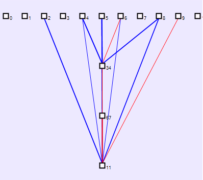

###HyperNEAT
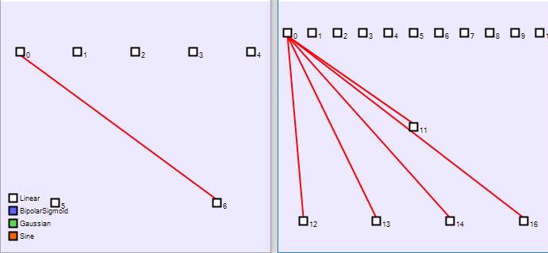

## Track 2

###NEAT
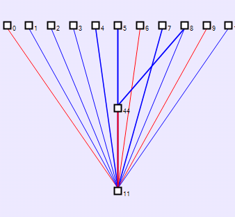

###HyperNEAT
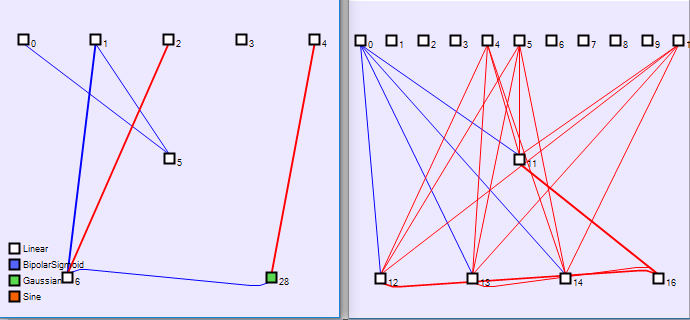

## Track 3

###NEAT
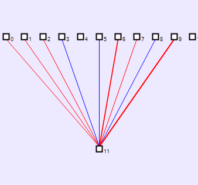

###HyperNEAT
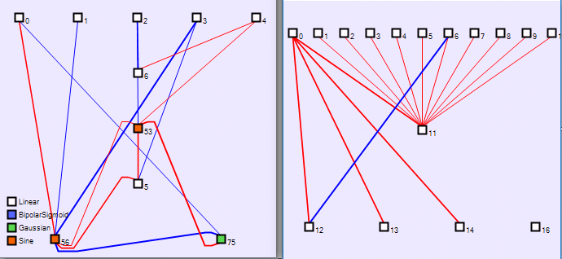

## Track 4

###NEAT
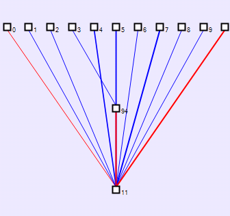

###HyperNEAT
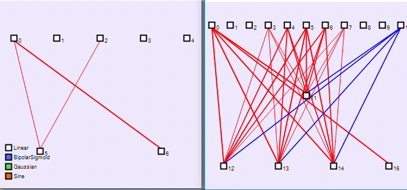

## Track 5

###NEAT
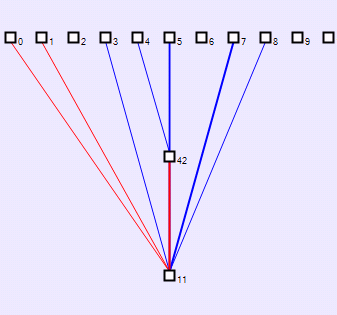

###HyperNEAT
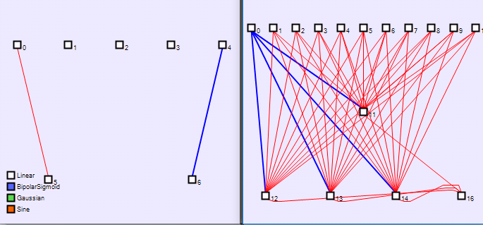

## Track 6

###NEAT
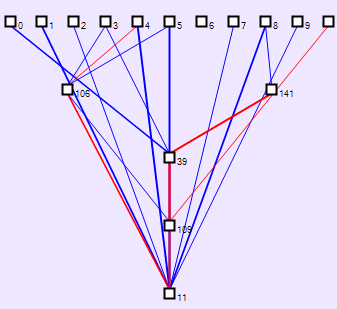

###HyperNEAT
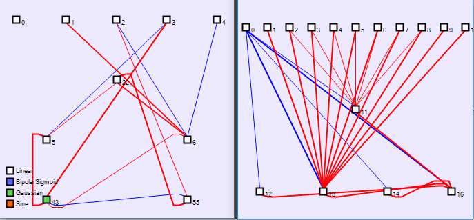

## Track 7

###NEAT
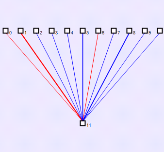

###HyperNEAT
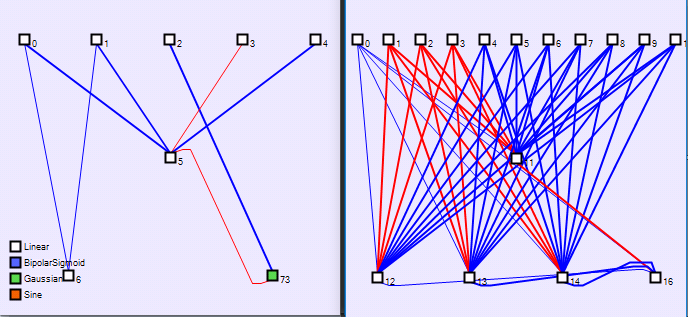

## Track 8

###NEAT
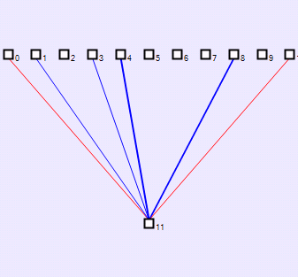

###HyperNEAT
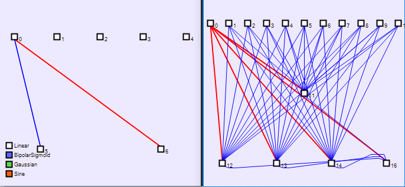

## Track 9

###NEAT
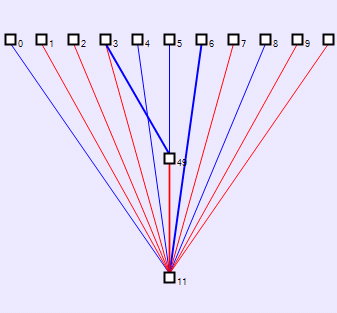

###HyperNEAT
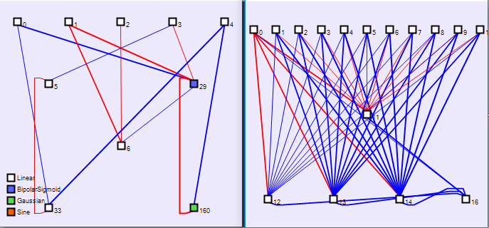

## Track 10

###NEAT
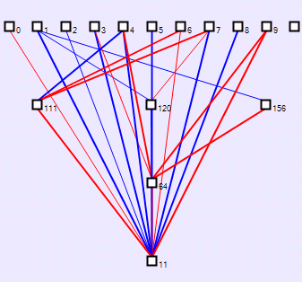

###HyperNEAT
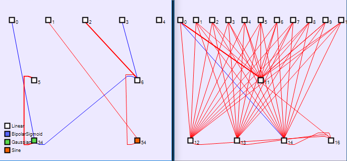

