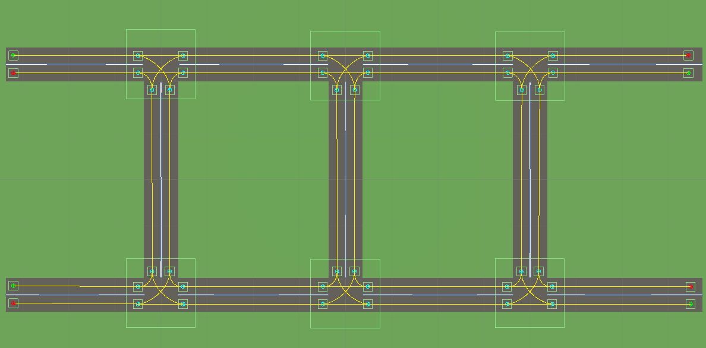
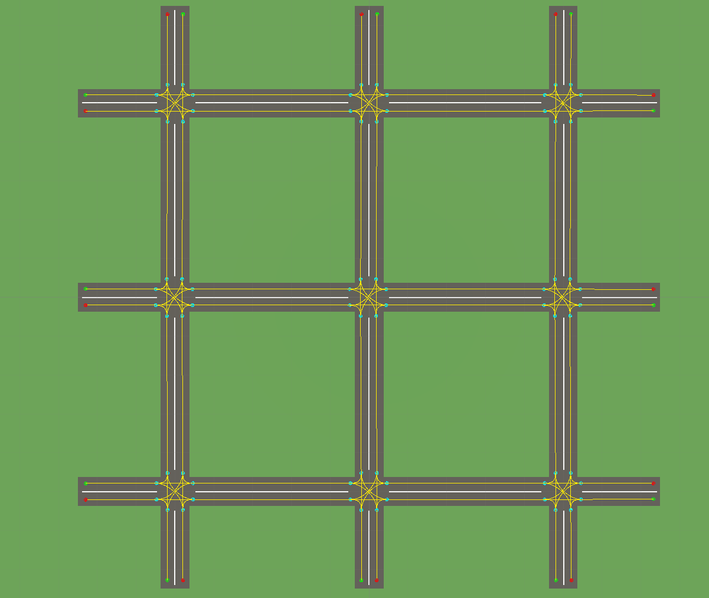
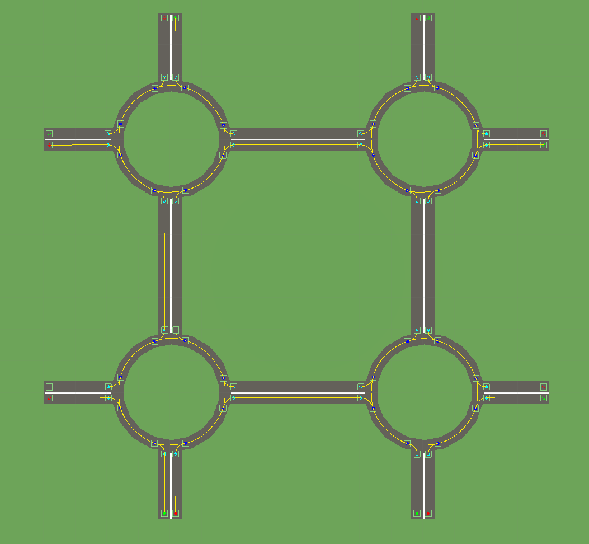
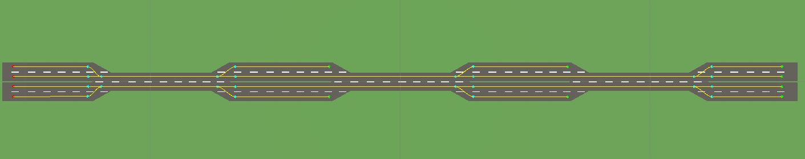
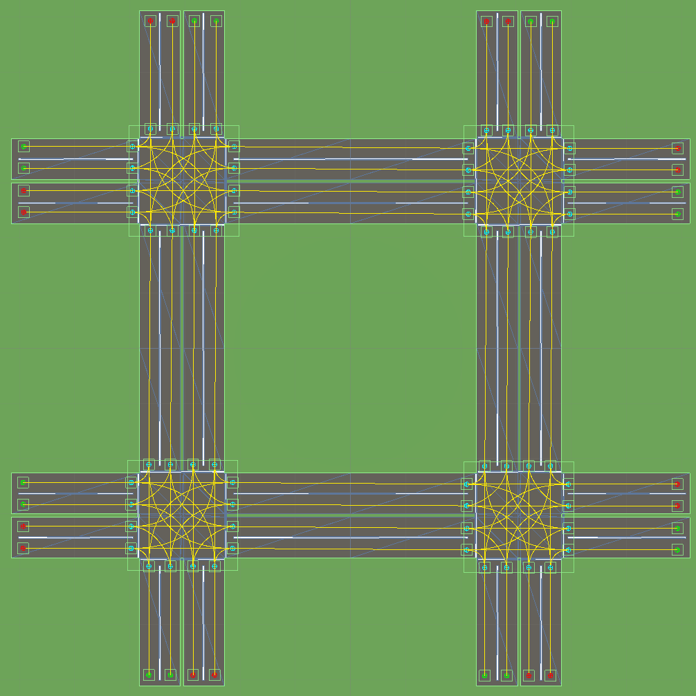
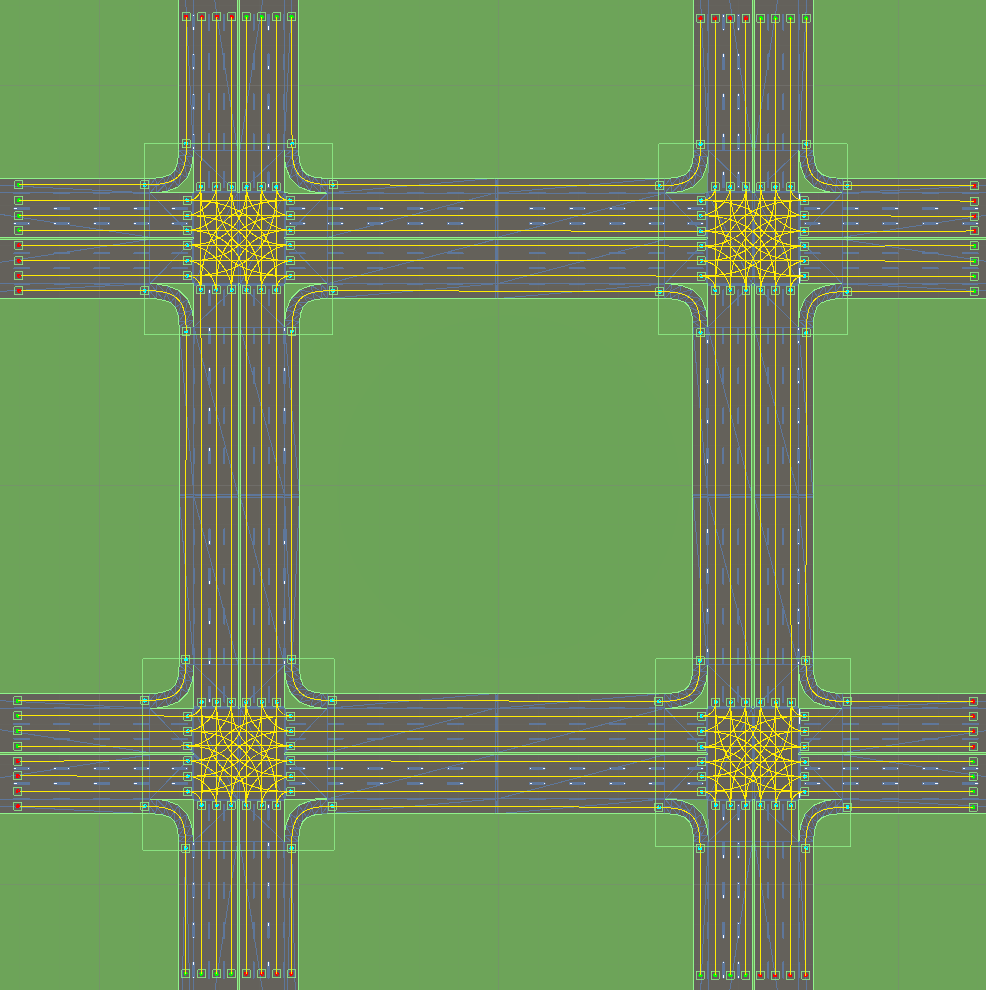
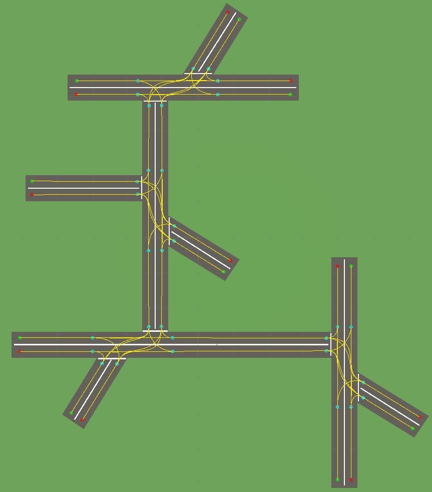
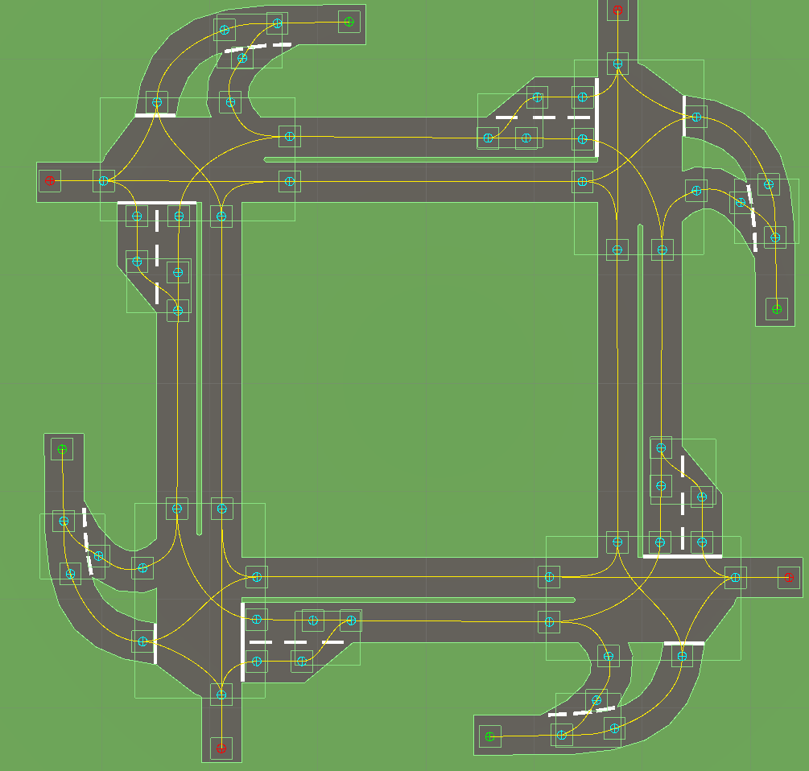
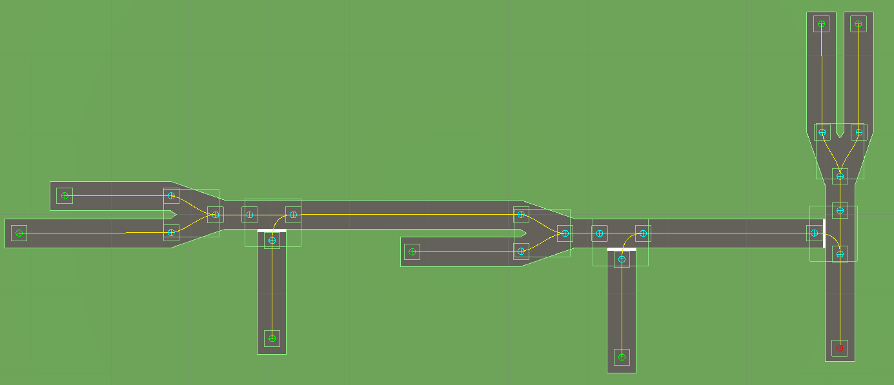
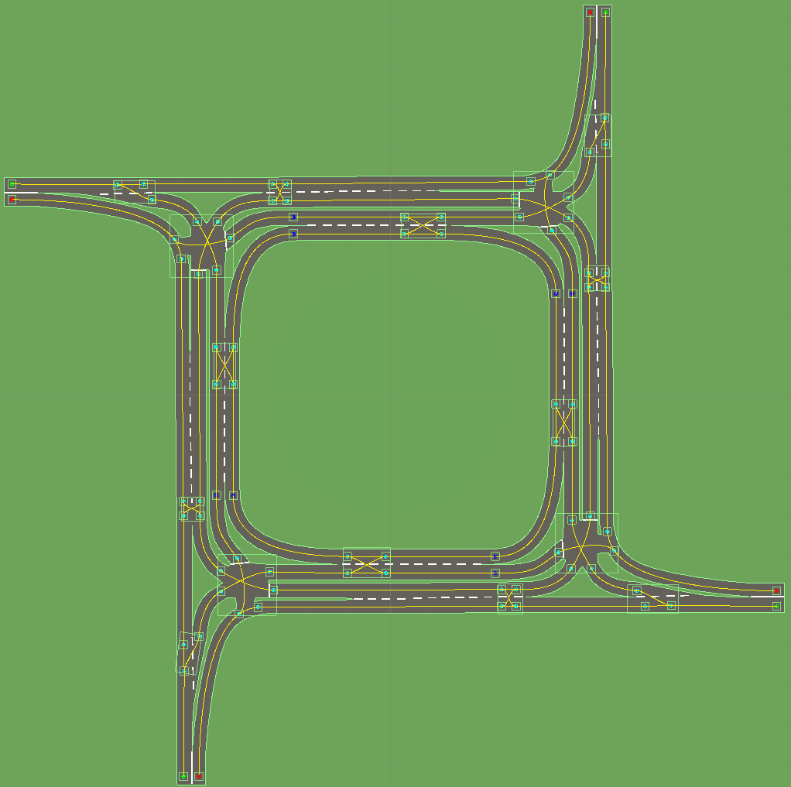

#__**Appendix A: Tracks**__

**Track 1: Simple T-Junction**

**Track 2: Four Way Intersection**

**Track 3: Four Way Traffic Circle**

**Track 4: Double Lane Merge**

**Track 5: Double Lane Four Way Intersection**

**Track 6: Triple Lane Four Way Intersection**

**Track 7: Offset Four Way Intersection**

**Track 8: Custom Intersection (Princess Ann Avenue, Cape Town)**

**Track 9: One Way Merge With Connecting Road**

**Track 10: Custom Intersection (Newlands Avenue, Cape Town)**

